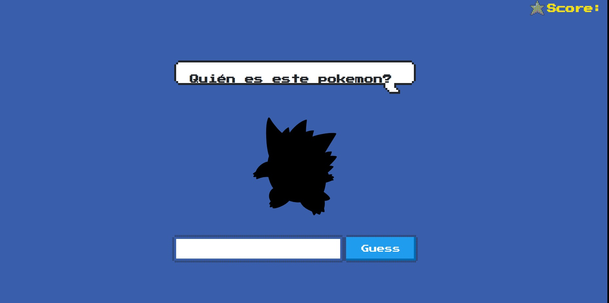

# Solution Challenge

## Esta es mi solución al reto propuesto

### Esta construido con javascript puro, html y css, además consumimos las api de pokemon para mostrar las imágenes pokemon

## Caracteristicas

- El juego inicia con la silueta del pokemon
- Si te equivocas en el nombre por medio del input corregimos caracteres especiales y espacios
- Tus intentos son ilimitados y al momento que reintentas te da una pista en la silueta pokemon
- Si alcanzas las 10 estrellas te conviertes en un maestro pokemon

